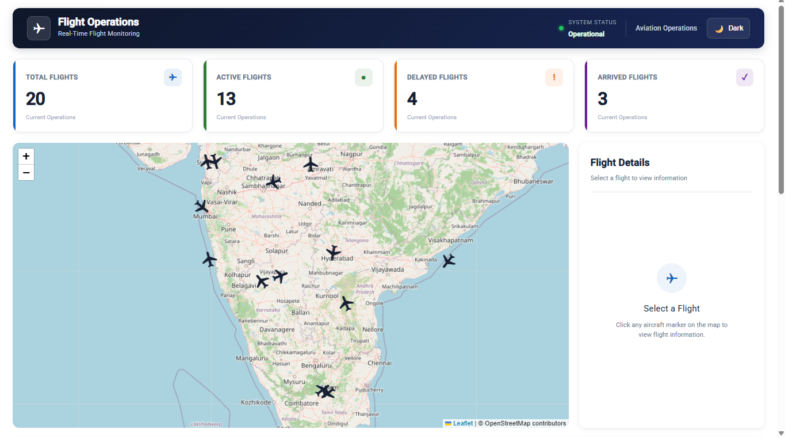
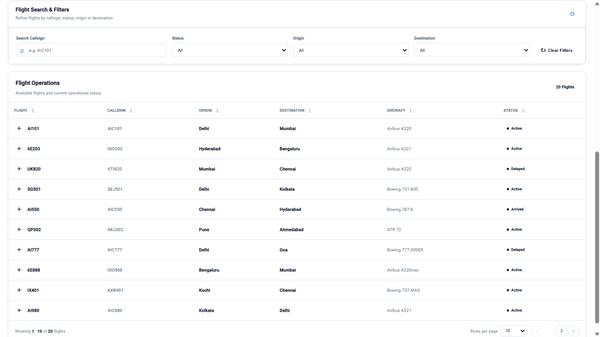
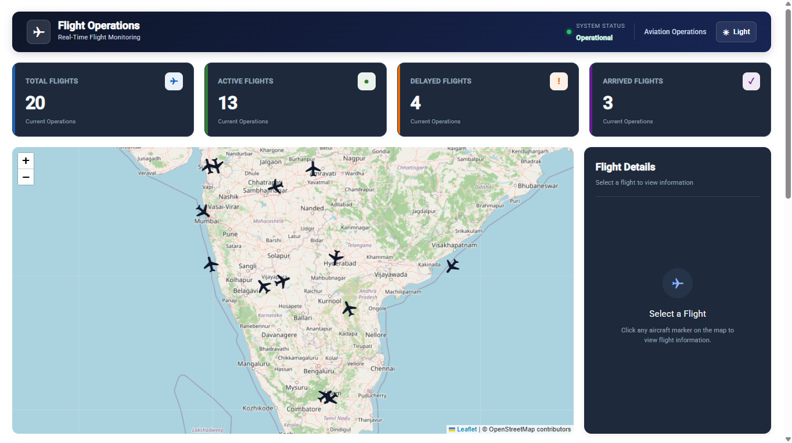
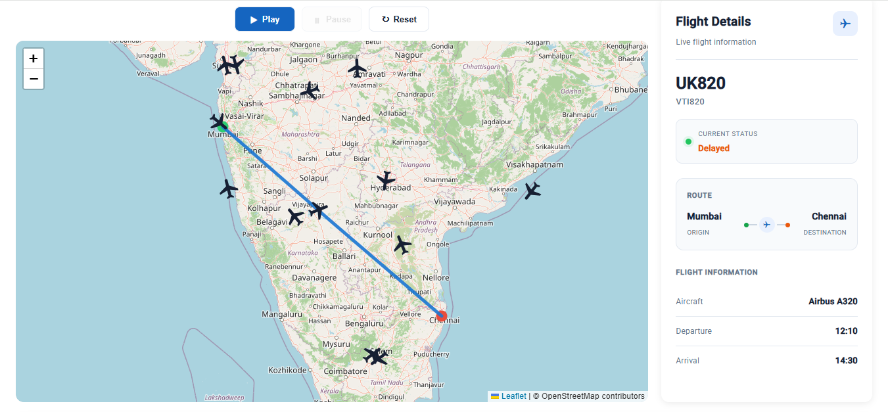
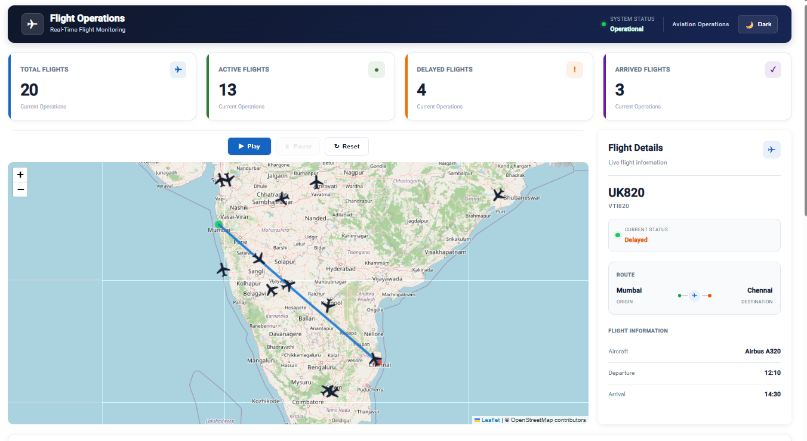

# ✈️ Flight Operations Dashboard

A responsive **Flight Operations & Tracking Dashboard** built with Angular 16 and Leaflet Maps.

The application provides an interactive aviation operations interface for monitoring flights, viewing aircraft positions, exploring flight routes, filtering operational data, and controlling flight movement through a simple Play / Pause / Reset animation.

---

## 📌 Project Overview

The Flight Operations Dashboard is designed to provide an aviation-style monitoring experience for flight operations teams.

The dashboard combines:

- Interactive flight tracking
- Aircraft markers
- Airport locations
- Flight route visualization
- Flight details
- Operational KPI cards
- Search and filtering
- Pagination
- Flight animation
- Light and dark themes
- Responsive desktop and tablet layouts

The application currently uses **mock flight data** to simulate real-world flight operations.

---

## 🎯 Assignment Objectives

The primary objectives of this project are:

1. Build a responsive flight tracking dashboard using Angular.
2. Integrate Leaflet for interactive map visualization.
3. Display multiple aircraft on an interactive map.
4. Allow users to select a flight and view its details.
5. Visualize the selected flight route.
6. Provide operational KPI information.
7. Implement search and filtering functionality.
8. Provide flight movement animation controls.
9. Support light and dark themes.
10. Follow a clean and maintainable Angular application structure.
11. Implement unit tests for key application functionality.

---

# ✨ Features

## 🗺️ Interactive Flight Map

The dashboard uses **Leaflet Maps** to provide an interactive flight tracking experience.

The map displays:

- Aircraft markers
- Current aircraft positions
- Aircraft direction
- Origin airports
- Destination airports
- Selected flight route
- Map zoom controls
- Automatic route fitting for selected flights

The application contains **20 mock flights** representing different operational states.

---

## ✈️ Aircraft Markers

Aircraft are displayed using custom aircraft-shaped markers.

Each aircraft marker:

- Shows the current flight position
- Uses the aircraft's calculated bearing
- Rotates according to the flight direction
- Can be clicked to select the flight
- Updates its position during animation

Clicking an aircraft marker selects the corresponding flight and updates the Flight Details panel.

---

## 🛫 Airport Visualization

When a flight is selected, the dashboard displays:

- Origin airport
- Destination airport

Different visual indicators are used to distinguish the origin and destination locations.

---

## 🛣️ Flight Route Visualization

When a flight is selected:

- The origin location is identified.
- The destination location is identified.
- A route polyline is drawn between them.
- The map automatically adjusts to display the complete route.
- The selected aircraft is highlighted through the active flight state.

---

# 📊 Operations Dashboard

The dashboard provides four KPI cards:

| KPI | Description |
|---|---|
| Total Flights | Total number of flights currently available |
| Active Flights | Flights currently marked as Active |
| Delayed Flights | Flights currently marked as Delayed |
| Arrived Flights | Flights that have completed their journey |

These KPI values are dynamically calculated from the flight data.

---

# 🔎 Search & Filters

The Flight Operations section provides multiple filtering options.

### Search by Callsign

Users can search flights using their callsign.

Example:

AIC101

# 🖼️ Screenshots

## Dashboard – Light Theme

## Flight Operations – Light Theme

## Dashboard – Dark Theme

## Selected Flight & Route

## Flight Animation

